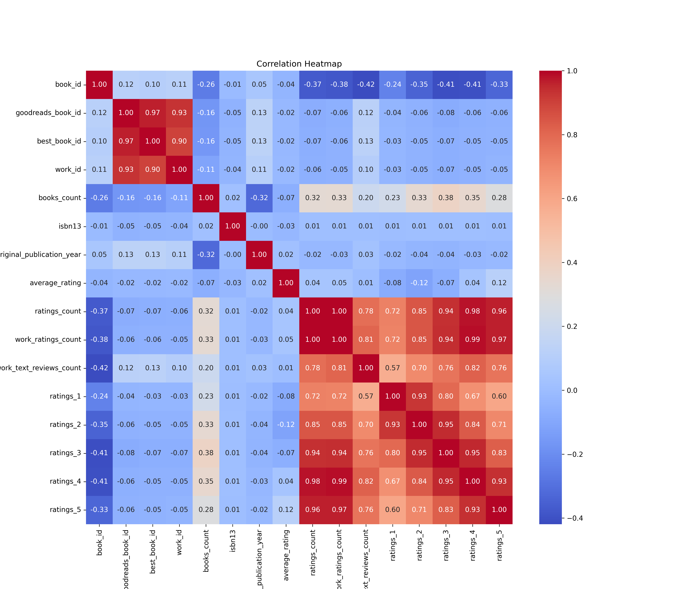
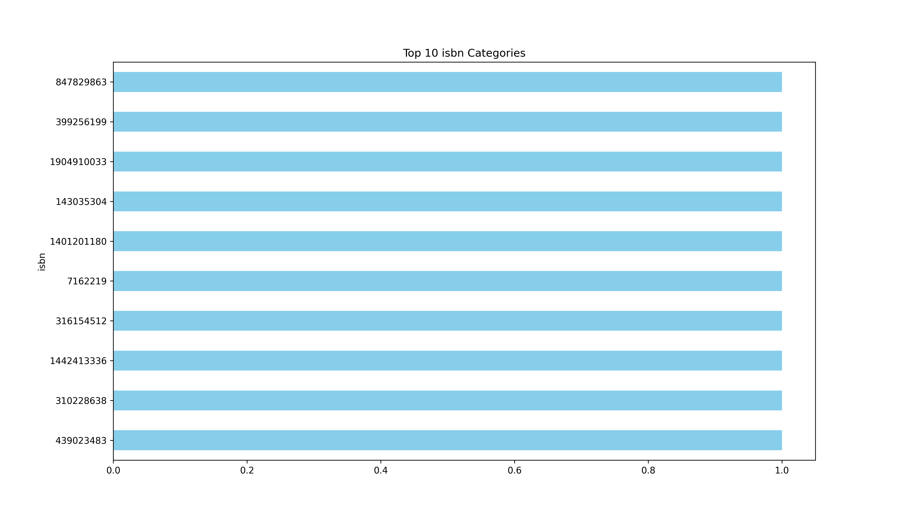

# Analysis Report

### Summary of the Goodreads Dataset

The dataset comprises 10,000 entries and 23 columns, primarily focusing on various books, their authors, publication details, and ratings on Goodreads. Key columns include identifiers (e.g., `book_id`, `goodreads_book_id`), publication information (e.g., `original_publication_year`, `language_code`), and rating metrics (e.g., `average_rating`, `ratings_count`, `work_text_reviews_count`).

### Key Insights

1. **Missing Values**:
   - The dataset has significant missing values in several key columns:
     - `isbn` (700 missing), `isbn13` (585 missing), `original_publication_year` (21 missing), `original_title` (585 missing), and `language_code` (1084 missing). 
   - These missing values may affect the completeness of analysis, especially for books that are cataloged using ISBN.

2. **Publication Year**:
   - The `original_publication_year` has a mean of approximately 1982, indicating that the dataset includes both classic and contemporary works. However, there are extreme outliers with years as early as -1750, which likely indicate data entry errors.

3. **Rating Distribution**:
   - The average rating across the dataset is 4.00 with a standard deviation of 0.25, indicating that most books are fairly well-received.
   - The `ratings_count` averages around 54,001, with a maximum of 4,780,653, suggesting a wide range in popularity among books.

4. **Author Popularity**:
   - The dataset features 4,664 unique authors, with Stephen King being the most frequently represented, appearing 60 times in the dataset. This highlights the prevalence of certain authors within the Goodreads community.

5. **Language Diversity**:
   - The `language_code` column shows 25 unique languages, but there are 1,084 missing values. The most common language is English, which appears in 6,341 entries, indicating a significant English-speaking user base on Goodreads.

6. **Visual Representation**:
   - A histogram displaying the distribution of `average_rating` could illustrate how ratings cluster around the higher end of the scale. Additionally, a bar chart comparing `ratings_count` for the top 10 books can provide insights into which titles are most popular.

### Recommendations

1. **Data Cleaning**:
   - Address missing values by investigating their causes. Consider imputing missing `isbn` and `isbn13` where possible, or removing entries with excessive missing data. Investigate outliers in `original_publication_year` to determine if they are valid or should be corrected.

2. **Enhanced Analysis**:
   - Perform a more detailed analysis of the authors section to identify trends in the types of books being published and rated. This could include analyzing genre or themes if such data can be categorized.

3. **Language Insights**:
   - Explore the language distribution further to understand the cultural diversity of the books. This can help in promoting books from underrepresented languages or regions.

4. **Engagement Strategies**:
   - Consider creating targeted campaigns for books with high ratings but low `ratings_count` to increase visibility and readership. This can help balance the representation of popular and lesser-known works.

5. **Visualizations**:
   - Utilize visualizations to present findings effectively. Charts comparing average ratings vs. `ratings_count` for authors might provide insights into the relationships between popularity and perceived quality.

By acting on these recommendations, stakeholders can enhance the dataset's usability and leverage insights for improving reader engagement and cataloging strategies.

