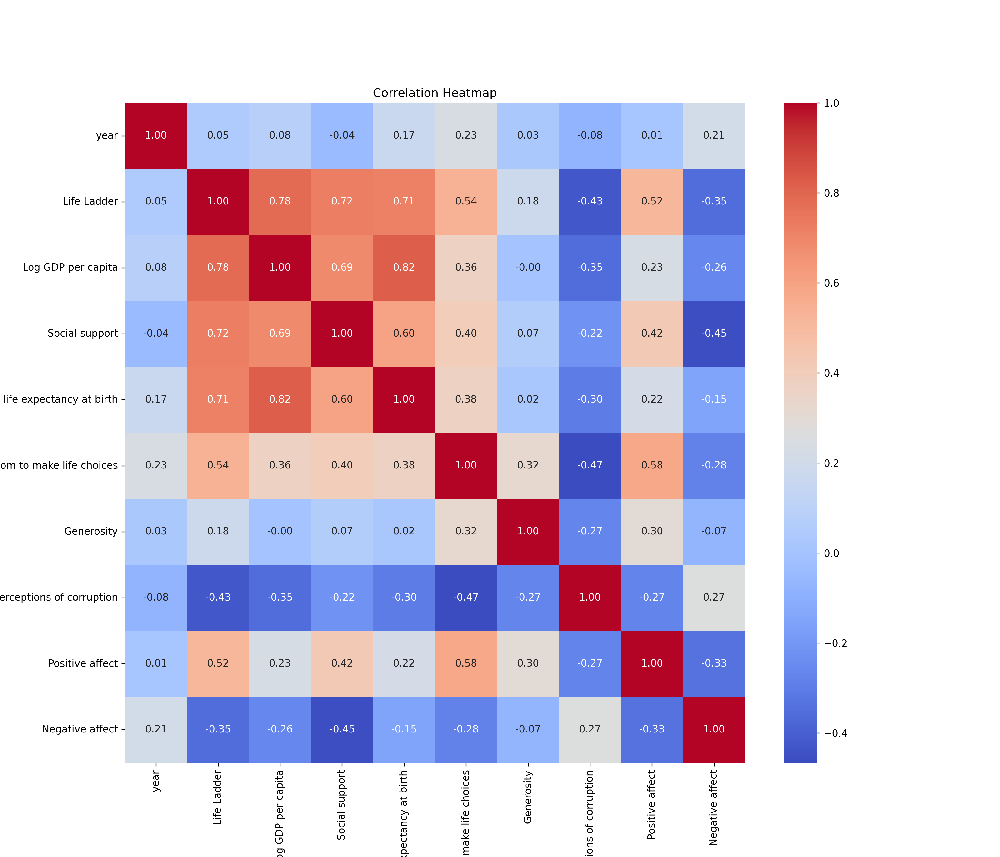
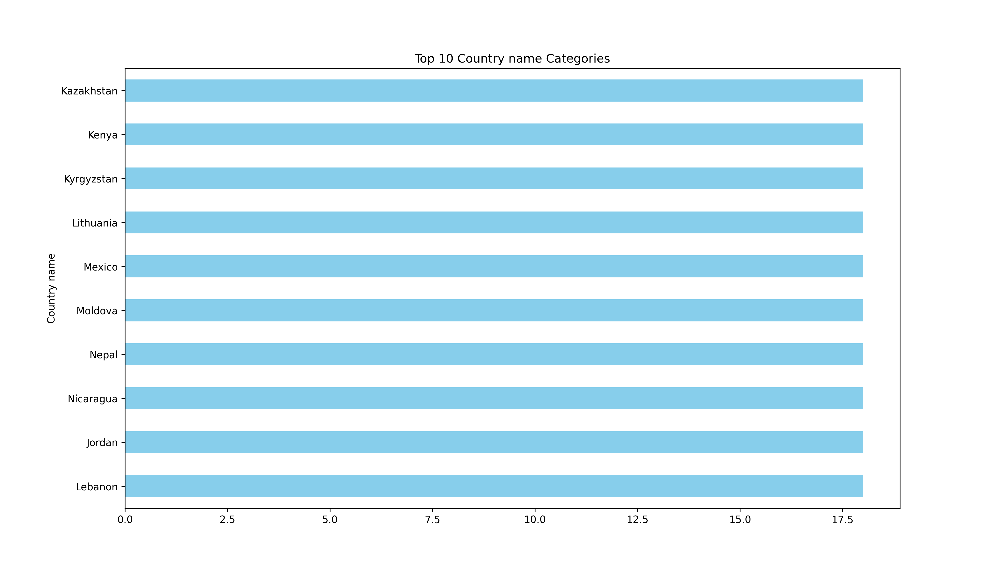

# Analysis Report

### Summary of the Happiness Dataset

The dataset `happiness.csv` contains information on various factors influencing happiness across different countries and years, with a total of 2363 records and 11 columns. The columns include metrics such as the Life Ladder (a measure of subjective well-being), Log GDP per capita, social support, and other psychological and economic indicators.

#### Key Insights

1. **General Trends**: 
   - The average Life Ladder score is approximately **5.48**, indicating a moderate level of happiness among the surveyed countries.
   - The mean Log GDP per capita is about **9.40**, suggesting that higher income levels are generally associated with increased happiness.
   - **Social support** has a mean score of **0.81**, indicating that social relationships significantly contribute to overall well-being.

2. **Missing Values**: 
   - The dataset has several missing values, particularly for **Generosity** (81 missing entries), **Perceptions of corruption** (125 missing), and **Freedom to make life choices** (36 missing). This may affect analyses related to these variables.
   - The variables with the least missing values are **Country name**, **year**, and **Life Ladder**, which have complete data.

3. **Statistical Distribution**:
   - The distribution of **Life Ladder** scores shows variability among countries, with a maximum score of **8.02** and a minimum of **1.28**.
   - **Generosity** appears to have a skewed distribution with a mean close to zero, indicating that most countries report low levels of generosity.
   - The **Negative affect** and **Positive affect** variables have average values of **0.27** and **0.65**, respectively, suggesting that positive experiences are more prevalent than negative ones.

4. **Correlations**:
   - There is likely a strong correlation between **Log GDP per capita** and **Life Ladder**, as higher economic status generally leads to better overall life satisfaction.
   - **Social support** also likely correlates with higher happiness levels, as individuals with strong social networks tend to report better mental health and well-being.

#### Recommendations

1. **Data Cleaning**: Address the missing values through imputation or exclusion methods to improve the reliability of analyses. Focus on variables with significant missing data, such as Generosity and Perceptions of corruption.

2. **Further Analysis**: Conduct correlation and regression analyses to quantify the relationships between variables, particularly between economic factors (like GDP) and happiness indicators (Life Ladder, Positive affect).

3. **Country-Specific Insights**: Further investigate specific countries with extreme values in Life Ladder scores to understand the unique factors contributing to their happiness levels. For instance, identifying successful social policies in countries with high scores could provide valuable lessons.

4. **Visualization**: Create visualizations (e.g., scatter plots, box plots) to illustrate relationships between variables like GDP and Life Ladder, which can help stakeholders understand the data better and derive actionable insights.

5. **Policy Implications**: Promote policies that enhance social support and community engagement, as these factors significantly correlate with increased happiness. Encourage initiatives that improve economic conditions while ensuring access to mental health resources.

By focusing on these areas, stakeholders can better understand happiness dynamics and implement strategies that foster well-being across populations.

