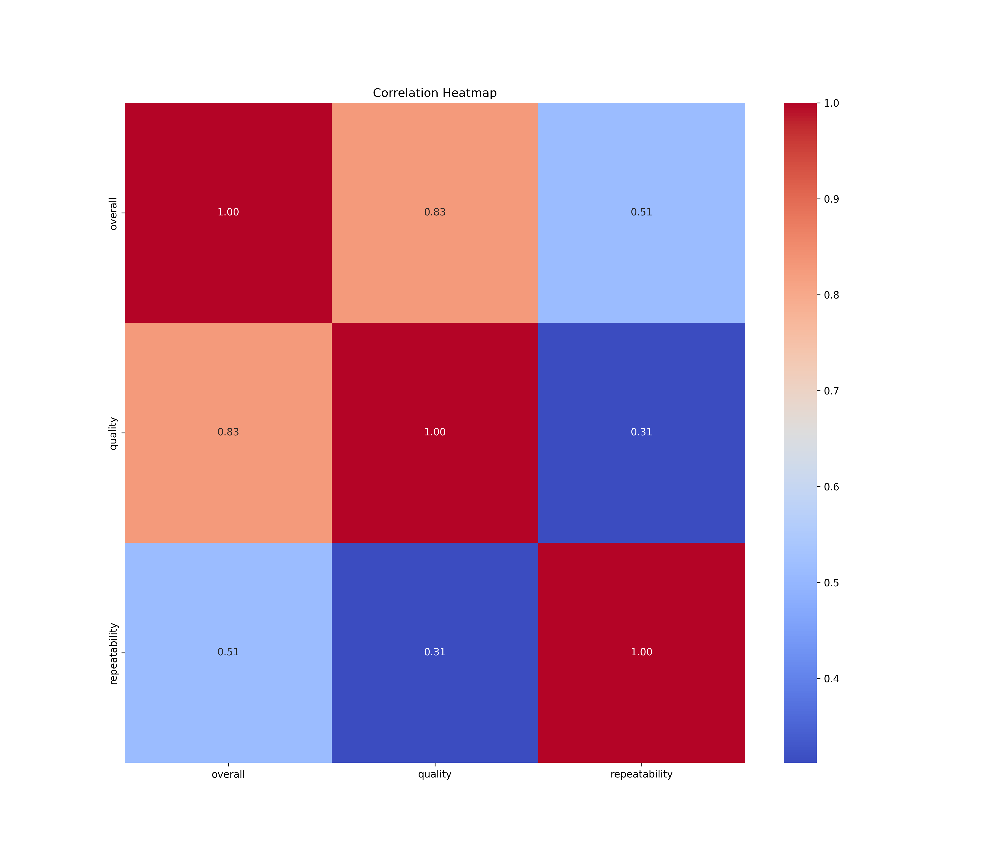
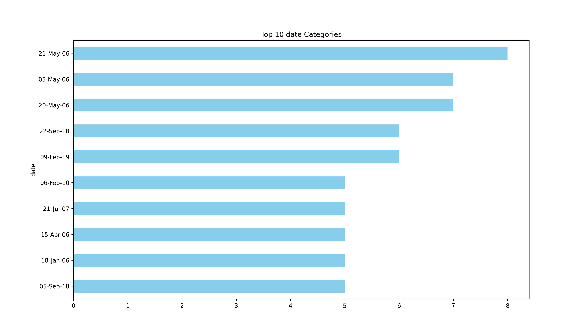

# Analysis Report

### Dataset Summary

The dataset `media.csv` consists of 2,652 entries and 8 columns, which provide various attributes related to media content. The columns include:

- **date**: The date of the media entry.
- **language**: The language in which the media is produced.
- **type**: The type of media (e.g., movie, series).
- **title**: The title of the media.
- **by**: The creator or producer of the media.
- **overall**: The overall rating of the media on a scale (e.g., 1 to 5).
- **quality**: The quality rating of the media on a scale (e.g., 1 to 5).
- **repeatability**: A metric indicating how likely the media is to be rewatched, on a scale (e.g., 1 to 3).

### Key Insights

1. **Missing Values**: 
   - The column `date` has 99 missing values, which could impact time-series analyses or trends over time.
   - The `by` column has 262 missing values, which may limit insights on creators and their contributions to the dataset.

2. **Language Distribution**:
   - The dataset contains media in 11 different languages, with English being the most frequent language (1,306 entries). This suggests a potential bias towards English-language media.

3. **Type of Media**:
   - The majority of the entries are categorized as movies (2,211 entries), indicating that the dataset may skew towards this type, potentially limiting insights into other media types such as series.

4. **Ratings**:
   - The overall mean rating is approximately 3.05, with a standard deviation of 0.76, suggesting a moderately favorable perception of the media.
   - The quality mean rating is slightly higher at around 3.21, indicating that users perceive the quality of the media as better than the overall experience.
   - The repeatability mean rating of 1.49 suggests that most media is not particularly rewatchable, with a peak at the lowest rating of 1.

5. **Popular Titles and Creators**:
   - The title "Kanda Naal Mudhal" appears most frequently, indicating it could be a significant media piece within this dataset.
   - The creator "Kiefer Sutherland" has the most entries but is limited to 48 occurrences, suggesting a diverse range of creators.

### Recommendations

1. **Address Missing Values**: 
   - Consider imputing missing values, particularly in the `date` and `by` columns, to improve analysis. This could enhance the dataset's utility for time-based analyses and insights into creator contributions.

2. **Explore Diversity in Media**:
   - Investigate the representation of non-English media and other types of media beyond movies. This may reveal untapped areas and help diversify content offerings.

3. **Analyze Ratings Further**:
   - Conduct a more in-depth analysis of media ratings to identify factors that contribute to higher ratings in `quality` versus `overall`. This could help in understanding audience preferences better.

4. **Investigate Rewatchability**:
   - Given the low repeatability ratings, explore factors that influence rewatchability. This could provide insights into engagement and retention strategies for media producers.

5. **Visualizations**:
   - Utilize charts such as bar graphs for language distribution, box plots for rating distributions, and time series plots for trends over time (once missing values are addressed) to enhance data presentation and interpretation.

By taking these steps, stakeholders can better understand audience preferences and improve media offerings based on insights derived from the dataset.

